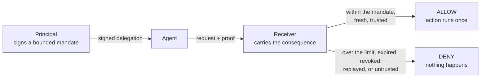

# Ratify Labs

**See an AI agent get stopped.** Not described, not diagrammed. Watch a real
system refuse a real request because nobody authorized it.

[**Open the catalog →**](https://labs.ratifyprotocol.com)

---

## What is this?

An agent with a valid credential can usually do anything that credential
permits. If a principal meant *"refund up to $100, for this one order, today,"*
that intent is gone by the time the request arrives somewhere else. The
receiving system sees a caller with a token, and executes.

[**Ratify Protocol**](https://github.com/identities-ai/ratify-protocol) closes
that gap. A principal signs a bounded mandate, the agent carries it, and the
system that will bear the consequence verifies it **offline, before acting**.



Ratify Labs is where you watch that happen. Each entry is a real
implementation with a working path, explicit bounds, inspectable source, and
recorded evidence. No pre-scripted outcomes.

## Which repository is which?

| Repository | What lives there |
|---|---|
| [**ratify-protocol**](https://github.com/identities-ai/ratify-protocol) | The specification, five SDKs, canonical test vectors, and the reference implementations |
| **ratify-labs** (this one) | The catalog, the shared design, the closed route registry, and the privacy-preserving router |
| Each reference's own repository | Its agent, receiver, deployment images, and adversarial tests |

Start with the protocol if you want to know what is being demonstrated. Start
here if you want to see it run.

Licensed under Apache-2.0. A listed platform is implementation context, never an
endorsement, partnership, or approved integration.

## What this repository contains

This repository contains the shared Labs homepage, visual system, closed route
registry, and privacy-preserving router. It does not contain the agent,
receiver, proof flow, deployment images, or adversarial test suite for each
reference. Those live in the reference's own public repository.

The main Ratify website's `/labs` URL is only an entry point. The canonical
catalog and all live lab routes are under `labs.ratifyprotocol.com`.

## Published references

A **lab** is a deployment you drive here. A **reference** is merged open source
you run yourself; this catalog gives it a page and links to the canonical
implementation in the protocol repository.

| Entry | What it shows | On Labs | Source |
|---|---|---|---|
| **Maritime × Ratify** | An agent passes at $420 and stops at $501 against a signed $500 ceiling | [Run the Maritime lab](https://labs.ratifyprotocol.com/maritime) | [Maritime implementation](https://github.com/identities-ai/ratify-maritime-reference) |
| **GitHub Copilot** | Copilot calls a deployment tool; a receiver checks the mandate first | [Read the Copilot reference](https://labs.ratifyprotocol.com/copilot) | [Copilot reference source](https://github.com/identities-ai/ratify-protocol/tree/main/references/github-copilot) |
| **Google ADK** | An ADK agent requests provisioning; the signed node ceiling is enforced | [Read the Google ADK reference](https://labs.ratifyprotocol.com/google-adk) | [Google ADK reference source](https://github.com/identities-ai/ratify-protocol/tree/main/references/google-adk) |
| **LangChain** | A LangChain agent crosses an MCP boundary and the receiver verifies who authorized it | [Read the LangChain reference](https://labs.ratifyprotocol.com/langchain) | [LangChain reference source](https://github.com/identities-ai/ratify-protocol/tree/main/references/langchain) |
| **NVIDIA OpenShell + NOOA** | One company's agent asks another's service to move money; the ceiling and named order are verified | [Read the NVIDIA reference](https://labs.ratifyprotocol.com/nvidia-openshell-nooa) | [NVIDIA reference source](https://github.com/identities-ai/ratify-protocol/tree/main/demos/nvidia-nooa-delegated-authority) |

A listed platform is implementation context. None of these is an endorsement,
partnership, or approved integration, and each reference says so in its own
words.

The Maritime repository contains the LangChain agent, separately deployed MCP
receiver, Ratify boundary implementation, Dockerfiles, issuance tooling,
Cloudflare scenario proxy, console source, tests, threat model, and deployment
evidence. This catalog repository only makes that independently deployed lab
discoverable at its stable Ratify Labs URL.

## Local development

```bash
npm install
npm test
```

Local routing requires `MARITIME_ORIGIN` and `LABS_ROUTER_TOKEN` in an ignored
`.env` file. Production values are managed as hosting secrets and environment
configuration; they never enter source control.

`npm test` runs the route registry check before building. It reads a pinned
snapshot of the protocol registry rather than fetching, so the result does not
depend on the network or on what has merged elsewhere. Refresh the pin
deliberately:

```bash
node scripts/sync-protocol-registry.mjs          # pin current protocol main
node scripts/generate-reference-pages.mjs        # regenerate page sections
```

Reference pages reproduce four sections from each canonical README in
`ratify-protocol`, so a page cannot state something its reference does not.
Page-specific copy lives in `app/lib/reference-editorial.ts`.

Routes and protocol registry slugs are deliberately allowed to differ: a route
is chosen for a reader, a slug for a repository. `scripts/check-routes.mjs`
asserts the mapping so the difference stays deliberate.

Read [`docs/PRODUCT-REQUIREMENTS.md`](docs/PRODUCT-REQUIREMENTS.md) before
adding a catalog entry or route.

See [`docs/PRIVACY.md`](docs/PRIVACY.md) for the application boundary and the
hosting layer's necessary abuse-prevention cookie.
